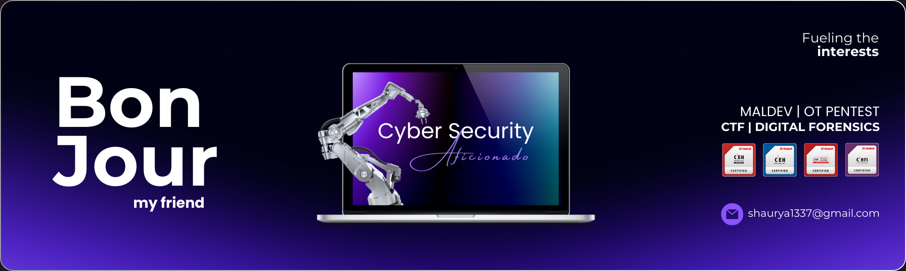

# Hi there, I'm [Shaurya] 👋

## About Me
I'm a Cyber security Ethusiast with keen interest in Maldev , OT Security , Capture the Flag events , Digital Forensics and Cyber Fraud Investigation & looking foward to contribute with innovative projects.

## Skills

### Languages

### Frameworks

    
    

